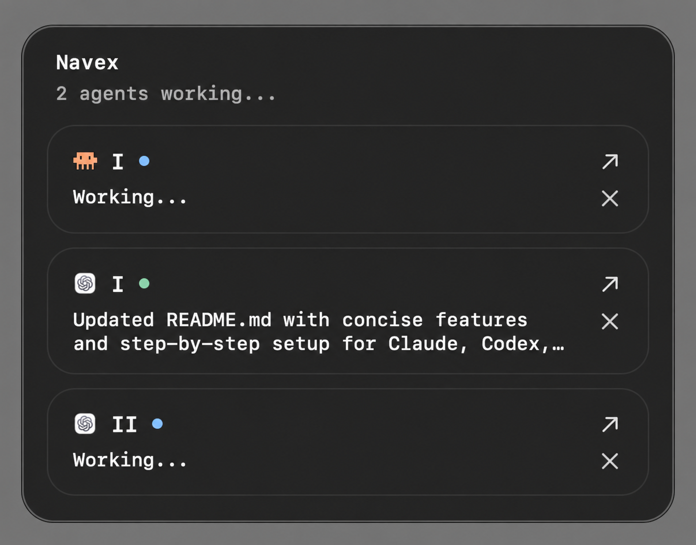

# Navex

A personal macOS menu-bar companion for Codex and Claude Code.

<p >
  
</p>

## Features

- Track working and finished agents from the CLI or desktop apps.
- See blue for working agents and green when control returns, with a one-line completion summary.
- Completion alerts slide in, then slide out 10 seconds after the latest finish; manual toggles remain immediate.
- Recognize Claude and Codex by their icons and separate Roman numbering.
- Open Codex desktop tasks or return to terminal sessions in Terminal.app and iTerm2. Claude desktop rows open the app; select the session there.
- Reorder, dismiss, and keep tracked sessions across restarts.
- Track Codex Cloud tasks and customize the overlay label, size, summaries, and hotkey.

Claude desktop support is for local Code sessions, not regular chats or remote/cloud sessions.

## Setup

### 1. Install Navex

Requires macOS, Node.js 18+, Xcode Command Line Tools (`xcode-select --install`), and Codex or Claude Code installed and signed in.

```bash
git clone https://github.com/navkul/navex.git
cd navex
npm install
npm link
```

Navex builds automatically during installation. Keep the cloned folder in place.

### 2. Set up your agents

Run either command, or both:

```bash
navex setup --claude
navex setup --codex
```

Each command configures tracking, preserves existing settings with backups, and starts Navex now and at login. No manual configuration edits are needed.

- **Claude Code:** restart existing Code sessions and Claude Desktop.
- **Codex:** start Codex, run `/hooks`, and trust the Navex **SessionStart**, **UserPromptSubmit**, **Stop**, **Interrupt**, and **SessionEnd** hooks. Then restart Codex Desktop. This trust review must be completed in Codex.

You can also configure both with `navex setup --claude --codex`. To disable automatic startup later, run `navex overlay uninstall-login`.

## Use Navex

Run `codex` or `claude` normally, or start a task in the corresponding desktop app. Submit a prompt and Navex will track its progress.

Press **⌘⌥K** to show or hide the overlay. Use the arrow to open a session, drag to reorder, or click × to dismiss a row.

Press **⌃⌥⌘K** (Control–Option–Command–K) to move Navex to the next connected display and show it. **⌘⌥K** only shows or hides it on the selected display. Your selection survives updates and restarts; pointer position and app focus never change it.

Navex starts on the primary display the first time. If the selected monitor disconnects, the overlay stays hidden until you select an available display with **⌃⌥⌘K**. The terminal equivalent is `navex overlay screen`.

```bash
navex sessions       # List tracked sessions
navex config show    # View preferences
navex --help         # All commands
```
